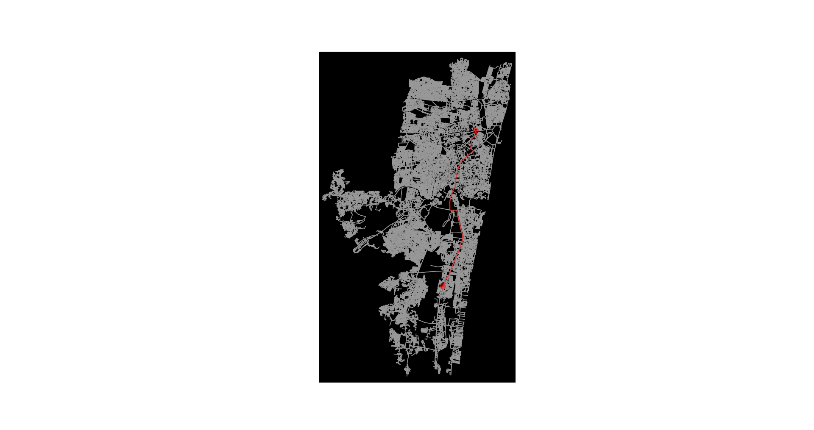

# Drone Path Navigation Using A* and Bellman-Ford Algorithms

## Overview
This project explores drone navigation in both simulated and real-world environments using two popular pathfinding algorithms: **A*** and **Bellman-Ford**. The implementation demonstrates the application of these algorithms to compute optimal paths while considering obstacles and penalties. 

Simulations were conducted using:
- **MATLAB** for grid-based environments.
- **Python** (with OpenStreetMap data) for large-scale geographical maps of any location.

## Features
- **A***: Fast, heuristic-driven pathfinding optimized for real-time applications.
- **Bellman-Ford**: Versatile algorithm capable of handling graphs with negative weights.
- **Obstacle Avoidance**: Dynamic penalty assignment for obstacle nodes.
- **Visualization**: Graphical representation of paths and obstacles.

## Technologies Used
- **Programming Languages**: Python, MATLAB
- **Python Libraries**:
  - `OSMnx`: Map data extraction
  - `NetworkX`: Graph manipulation
  - `Matplotlib`: Visualization
  - `Heapq`: Priority queue implementation

## Installation
1. Clone this repository:
   ```bash
   git clone https://github.com/souradeepdutta/Drone-Path-Navigation-Simulation.git
   ```
2. Navigate to the project directory:
   ```bash
   cd drone-path-navigation
   ```
3. Install Python dependencies:
   ```bash
   pip install -r requirements.txt
   ```

## Usage
### MATLAB
1. Open the MATLAB scripts in the `MATLAB` directory.
2. Run the `Main.m` to simulate pathfinding on a grid.

### Python
1. Prepare your environment:
   - Ensure Python 3.x is installed.
   - Install dependencies using the command above.
2. Run the Python scripts:
   ```bash
   python A_star.py
   ```
   or
   ```bash
   python Bellman_Ford.py
   ```
3. Visualize the paths on maps of Chennai or Manhattan.
4. Your can modify the location according to your preference.

## Experimental Setup
### Environments
- **Grid-based** (MATLAB): 10x10 grid with predefined obstacles.
- **Geographical Maps** (Python): Road networks extracted using OpenStreetMap.

### Obstacles
- High-weight nodes.
- Infinite-cost edges.
- Dynamic penalties for obstacle avoidance.

### Performance Metrics
- **Computational Time**: Measured in seconds.
- **Path Length**: Measured in number of nodes.

### Results
- **A***: Faster computation due to heuristic-driven approach.
- **Bellman-Ford**: More versatile but slower in complex environments.

## Example Visualizations
### Chennai, India


### Manhattan, USA


## License
This project is licensed under the MIT License. See the [LICENSE](LICENSE) file for details.
